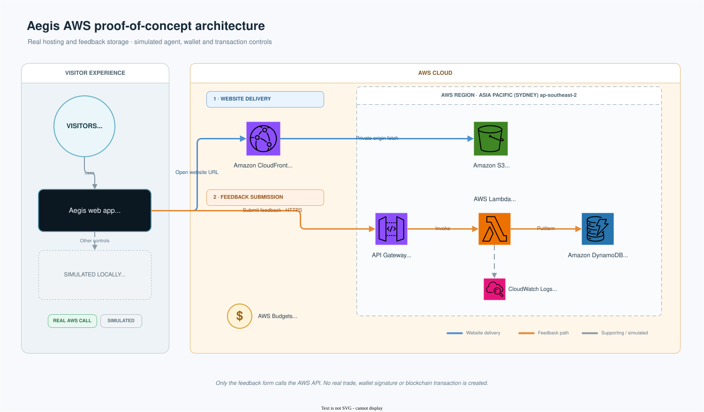
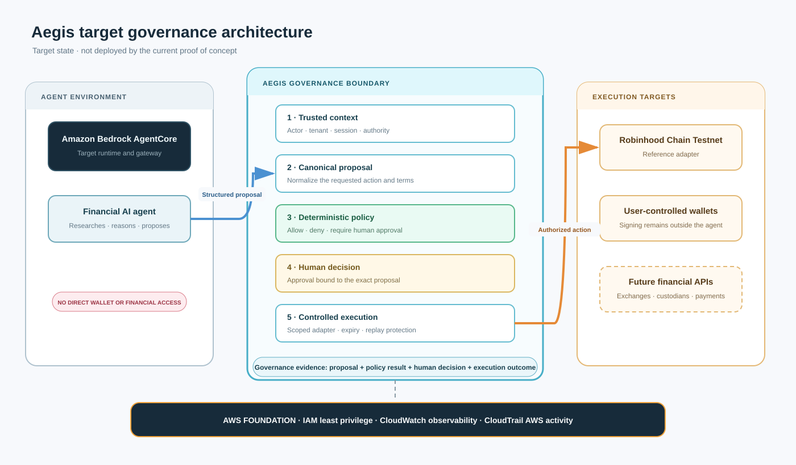

# Aegis — Governance for Financial AI Agents

AWS-hosted showing how deterministic policy, human approval, constrained execution and governance evidence can sit between an AI agent and a financial action.

An agent may research and propose an action. Aegis is the control layer that decides whether that action is allowed, blocked or must be reviewed by a human before an execution system can receive it.

This repository does not contain a production trading or financial governance system. It does not use real funds and is not affiliated with or endorsed by AWS, Amazon, Robinhood, NVIDIA, Chainlink, or any wallet/liquidity provider. The Robinhood Chain Testnet portfolio is a simulated reference use case, not the boundary of the Aegis concept.

## Governance model

```text
AI agent                 Aegis governance                       Execution target
Researches        →      Validates trusted context       →      Receives only an
Reasons                  Normalises the proposal                authorised action
Proposes                 Applies deterministic policy
                         Requests human approval
                         Records governance evidence
```

The agent does not decide its own permissions, approve its own proposal or receive unrestricted financial credentials.

## AWS-hosted

The public website is hosted on AWS in the Sydney Region. CloudFront serves the frontend globally from a private S3 origin. The interface is deliberately realistic, but the portfolio, AI research, policy decisions, wallet connection, approvals, token activity and blockchain transactions are simulations.

The feedback path is real: when a visitor submits the feedback form, the browser sends an anonymous response through API Gateway to Lambda, which validates it and writes it to DynamoDB. No wallet address or email address is collected.

## Current deployed AWS architecture



The editable diagram source is available in [draw.io format](docs/architecture/aegis-aws-architecture.drawio).

This diagram describes what is deployed today: website delivery and anonymous feedback storage. It does not contain Amazon Bedrock AgentCore or a financial execution backend.

### Request flow

1. A visitor opens the CloudFront URL from anywhere in the world.
2. CloudFront retrieves the static Aegis application from a private, encrypted S3 bucket and delivers it over HTTPS.
3. Most buttons update deterministic demonstration state in the browser; they do not call an AI model, wallet or blockchain.
4. Submitting **Share feedback** sends `POST /feedback` directly from the browser to API Gateway.
5. API Gateway invokes a small Python Lambda function.
6. Lambda validates the anonymous response and writes it to an encrypted, on-demand DynamoDB table.
7. Lambda execution logs expire after seven days, and AWS Budgets emails alerts when forecast spending reaches 80% of the $5 monthly budget or actual spending reaches $5.

| AWS service | Purpose in this POC |
| --- | --- |
| CloudFront | Public HTTPS URL, global caching and security headers |
| S3 | Private storage for the exported website files |
| API Gateway | Public, throttled `POST /feedback` endpoint |
| Lambda | Validates feedback and writes only to the feedback table |
| DynamoDB | Stores anonymous votes and comments with a one-year TTL |
| CloudWatch Logs | Retains Lambda diagnostic logs for seven days |
| AWS Budgets | Sends cost alerts; it warns but does not stop spending |
| CDK and CloudFormation | Define and deploy the infrastructure reproducibly |

The API is intentionally anonymous for the POC. API Gateway is throttled to 5 requests per second with a burst of 20, and Lambda has a five-second timeout. The feedback service exposes no read endpoint to the public website.

## Target governance architecture



The editable target diagram is available in [draw.io format](docs/architecture/aegis-target-governance.drawio).

The target diagram is a product direction, not a diagram of currently deployed resources. In that architecture:

1. An agent running in an environment such as Amazon Bedrock AgentCore submits a structured proposal.
2. Aegis obtains trusted actor, tenant and session context outside the proposal itself.
3. Aegis normalises the action and applies deterministic financial policies.
4. Consequential actions pause for a human decision bound to the exact proposal.
5. A scoped execution adapter receives only an authorised, unexpired action.
6. Aegis records the proposal, policy result, approval and execution outcome as business-level governance evidence.

IAM supplies explicitly configured least-privilege roles. CloudWatch and CloudTrail support operational visibility, but they do not replace Aegis's business-level decision record.

## Current outcome

- Recommended mode: mock assets on Robinhood Chain Testnet.
- Phase 0 status: complete; the project owner accepted the documented defaults on 2026-09-20.
- POC direction: a frontend-first, clearly labelled demonstration of Aegis as the governance layer between financial agents and execution. The positioning is recorded in [ADR 0008](docs/adr/0008-financial-agent-governance-positioning.md).
- Amazon Bedrock AgentCore is a target runtime for a possible later functional spike; it is not deployed by the current stack.
- Test token: `Aegis Guard Dog Test` (`GDOGT`) is prepared as a fixed-supply, valueless Robinhood Chain Testnet demo token under [ADR 0006](docs/adr/0006-testnet-demo-meme-token.md); it is not deployed or offered for sale.
- AWS POC hosting and central feedback infrastructure are deployed under [ADR 0007](docs/adr/0007-minimal-aws-poc-deployment.md).
- A later functional agent would require Bedrock model access and valueless testnet ETH before any mock-contract deployment.
- No contracts were deployed, wallets created, funds moved, transactions signed, or transactions broadcast during Phase 0.

Read [the feasibility report](docs/feasibility-report.md), [the threat model](docs/threat-model.md), and [the ADRs](docs/adr/).

## Commands

```bash
make test
make probe

cd web
npm run dev
npm run build
```

`make probe` uses the intentionally incomplete checked-in example configuration. It is expected to fail or report unavailable components until local testnet inputs are supplied. See [the probe guide](spikes/connectivity_probe/README.md).

The frontend POC runs locally at `http://localhost:5173` during development. Its portfolio, agent, policy, approval, and audit flows are deterministic simulations; the persistent demo disclosures are part of the product boundary defined in ADR 0005. The deployed CloudFront URL is available from the `WebsiteUrl` output of the `AegisFeedbackPoc` CloudFormation stack.
